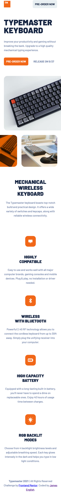
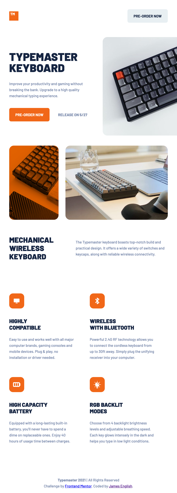
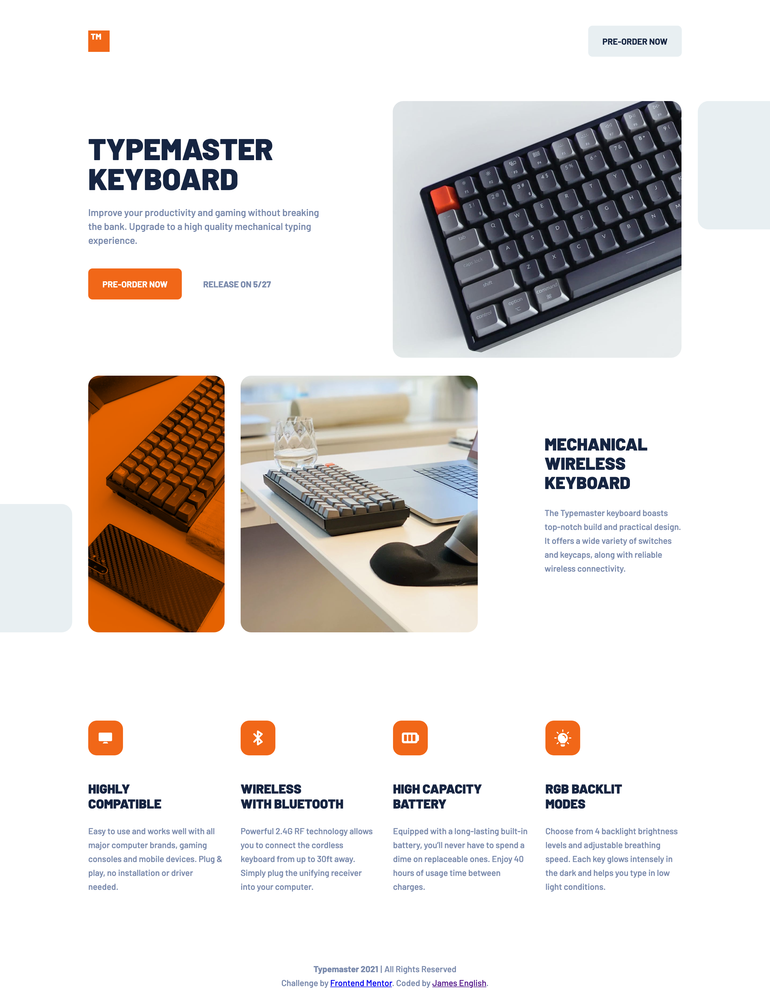

# Frontend Mentor - Typemaster pre-launch landing page solution

This is a solution to the [Typemaster pre-launch landing page challenge on Frontend Mentor](https://www.frontendmentor.io/challenges/typemaster-prelaunch-landing-page-J6-Yj5J-X/hub/typemaster-prelaunch-landing-page-5hRmzoCgO). Frontend Mentor challenges help you improve your coding skills by building realistic projects.

## Table of contents

- [Frontend Mentor - Typemaster pre-launch landing page solution](#frontend-mentor---typemaster-pre-launch-landing-page-solution)
  - [Table of contents](#table-of-contents)
  - [Overview](#overview)
    - [The challenge](#the-challenge)
    - [Screenshots](#screenshots)
    - [Links](#links)
  - [My process](#my-process)
    - [Built with](#built-with)
    - [What I learned](#what-i-learned)
    - [Continued development](#continued-development)
    - [Useful resources](#useful-resources)
  - [Author](#author)

## Overview

### The challenge

Your users should be able to:

- View the optimal layout depending on their device's screen size
- See hover states for interactive elements

### Screenshots

### Links

- Solution URL: [Frontend Mentor](https://www.frontendmentor.io/solutions/mobile-first-using-sass-flexbox-grid-9lz2AKi5u)
- Live Site URL: [Vercel](https://fem-typemaster-pre-launch.vercel.app/)

## My process

### Built with

- Semantic HTML5 markup
- Sass
- Flexbox
- CSS Grid
- Mobile-first workflow

### What I learned

This was my second project using Sass, and I'm starting to like it a lot, although I still need some practice to learn how to use it most efficiently.

### Continued development

I will continue working on my front end development skills, especially learning to exploit Sass.

### Useful resources

- [CSS Tricks - Color Filters](https://css-tricks.com/color-filters-can-turn-your-gray-skies-blue/) - I found this a neat trick to add the orange color to the second picture of the keyboard. Using a background color and opacity works, but makes the image look too washed out.

## Author

- Codepen - [@anglicus](https://codepen.io/anglicus)
- Frontend Mentor - [@anglicus](https://www.frontendmentor.io/profile/anglicus)
- FreeCodeCamp [@anglicus] (https://www.freecodecamp.org/anglicus)
